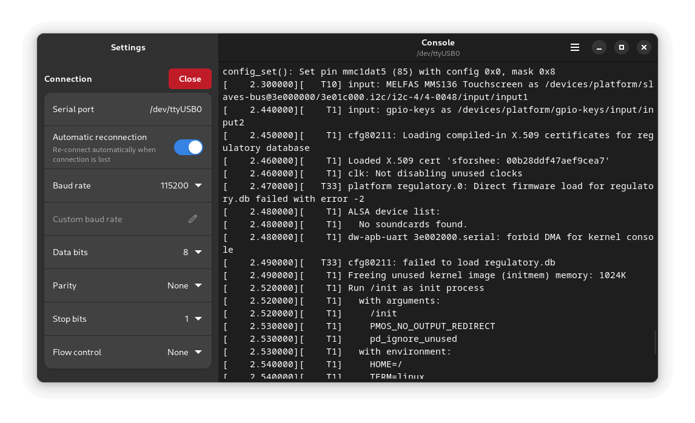

# Serial Console

Access any serial console



## Dependencies

- Python >= 3.11
- GTK4 >= 4.14.0
- libadwaita >= 1.5.0
- pygobject
- [pyserial](https://pypi.org/project/pyserial/)

## Building

We use the meson build system. The build process is as follows:

```
meson output
meson compile -C output
meson install -C output
```

For development purposes, this is automated in the provided `run` script.

### Commit style

**Please follow the following commit style:**

 - All commits have a prefix that contains the area of the code that has been changed:
   - For the README.md file, build files (meson.build) and things like .gitignore, this is `meta:`
   - For anything in the data directory, this is `data:`
   - For anything related to translations or the po directory, this is `po:`
   - For the actual code, this is the filename of the main file you've edited, e.g. `fileview:`
 - Commit messages are in all lowercase, except for class names, filenames (if they're capitalized - like README, COPYING etc.) and project names (e.g. Musicbrainz).
